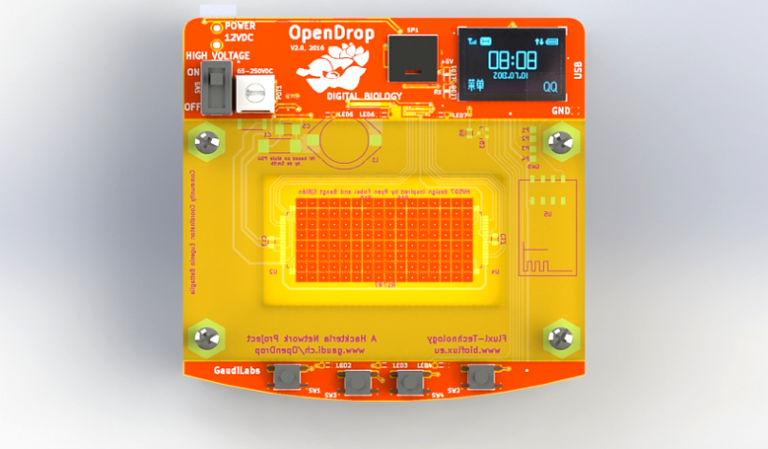

[OpenDrop](http://www.gaudi.ch/OpenDrop/) is an open hardware-based design for microfluidics analysis.
Microfluidics is the study of how fluids behave and can be controlled at
the very smallest levels.

The device uses recently-developed technology called “electro-wetting” to control small droplets of liquids. Using this technology, users can carry out digital biology experiments in the lab and in their own home. While the uses of the OpenDrop are currently quite specific and niche, its significance lies in the principles of openness, accessibility and collaboration which lie behind it. Inspired by other equipment like the DropBot and Microdrop software, OpenDrop was designed with a DIY and low-cost approach, and is part of a larger ecosystem of digital biology initiatives whose aim is to make digital biology and lab automation accessible to people. It was designed in accordance with the best practices for Open-Source Hardware (OSHWA) and the [GOSH (Global Open Science Hardware) Manifesto](http://openhardware.science/gosh-manifesto/).

The development process is continually shared and facilitated by the project leaders through presentations at public events, through involving different communities and initiatives, and through organizing interdisciplinary workshops. Initiated and developed in Switzerland, the project is currently at its second release and has been developed through the collaborative efforts of an international network of organisations and communities of biohackers, scientists and artists. 
Thanks to this collaboration, its applications now spread beyond science to fields such as art, music, games and education. The project was initiated by [Urs Gaudenz (Gaudilabs)](http://www.gaudi.ch/GaudiLabs/) and developed by several communities including [hackteria | open source biological art](http://www.hackteria.org/), BioFlux and digi.bio.
