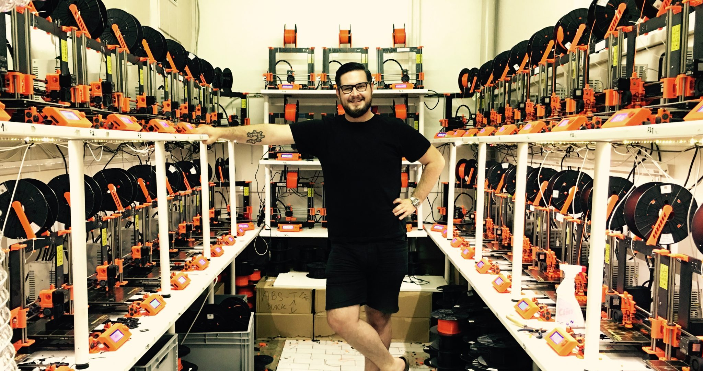

[Prusa machines](http://www.prusa3d.com/) are open-source 3D printers built upon the open hardware global initiative RepRap, which makes self-replicating and low-cost printers accessible to all.

Prusa Research is a company founded by the young maker Joseph Prusa, who started developing his first open hardware 3D printer when he was only 26. It now provides an open-source alternative to proprietary 3D printers and its models have rapidly grown to become the most widely used internationally.

The Prusa 3D-printers derive from the RepRap printer, which is made of 3D-printed parts so that anyone can copy and make their own self-replicating machines, democratising access to this new technology. The machines rely on a full open-source ecosystem of tools and are fully compatible with software tools such as Slic3r slicer, developed by the Italian Alessandro Ranellucci and Cura, developed by the Dutch 3D-printer firm Ultimaker.

The company has rapidly grown from its base in Prague: it now employs 40 people and offers customer service support to users as they assemble and customise their printers. Prusa was able to grow without a sales team, through word of mouth and with the support of the international maker community. Its models are direct competitors to the big names of the industry, which are based on proprietary models.

According to 3DHubs, an online 3D-printing community service, the Prusa i3 is the most used 3D-printer in the world and is now shipped to 90 countries.Prusa Research’s machines are open source, community driven, but they are also very good products: the latest machine offers a bigger build volume and faster printing. The quality of product is also related to the fact that this maker company based in Europe releases disrupting technological inventions all around the world, such as the full metal nozzle and the famous red PCB heated bed.