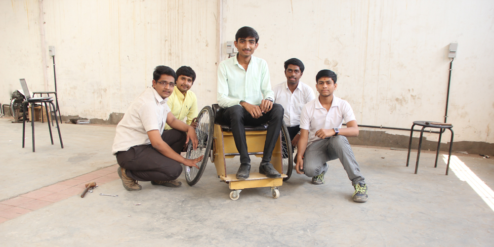

[TooWheels](http://toowheels.org/) is an open-source DIY toolkit to build a sports wheelchair. It is low-cost, adaptable and easy to build.  Too Wheels provides a low-cost and adaptable DIY alternative to expensive ready-made sports wheelchairs.

Makers are able to download the open-source wheelchair blue-print, adjust the design based on their unique measurements and build the finished product from cheap and easily available materials such as plywood, metal tubing and bicycle wheels. If built correctly, for as little as €200 anyone across the world can own a sports wheelchair with the same performance as that of a €2,000 pre-made alternative. Fabrizio Alessi, founder of Too Wheels, first started designing the DIY wheelchair as a student after spending time volunteering with a disability charity. 

Although state funding in Italy, Fabrizio’s home nation, provides standard wheelchairs for disabled people, the more expensive wheelchairs required for playing sports are not covered. Using TooWheels, children and adults alike are able to play a host of games including basket-ball, tennis, softball or rugby. TooWheels connects the ideals of open-source technology with the culture of making. There are two methods for building a TooWheels sports wheelchair&#58; 

– Download and print the A4 manual. When the printed pages are arranged in the correct order, they form a 1:1 template of each individual part. Creators can then use materials and tools from any local DIY store to cut individual pieces to the required dimensions, based on their own body measurements. No specialist skills are required. Once the component parts are attached together, the sports wheelchair is ready to use!

– A maker has access to a Computer Numeric Control (CNC) ma-chine (found in your local FabLab) and she or he can download the design in a digital format. When the digital design is input into the CNC machine, individual parts can be cut automatically. 

Sports wheelchairs have been built using the TooWheels open-source design in various locations across the world; for example, a TooWheels wheelchair was built in Ecuador’s FabLab Yachay through a grant from the Fab Foundation. Elsewhere, students at India’s Gujarat Technological University have built their own sports wheelchair. 

