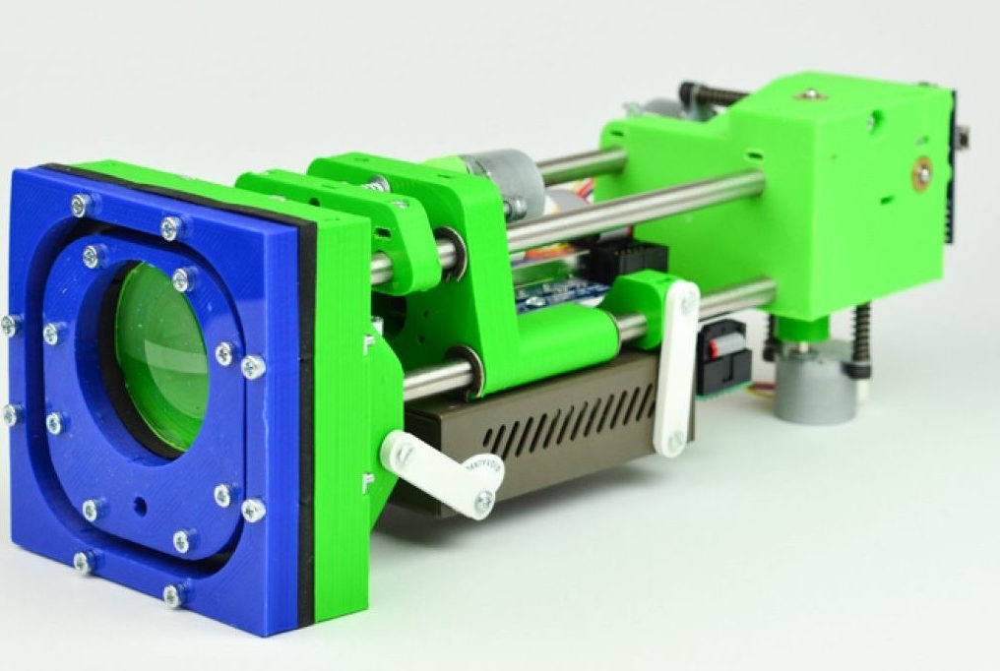

[Koruza](http://www.koruza.net/) is a DIY-friendly wireless optical communication system that offers a cheap and open-source alternative for connectivity in urban environments, connecting locations at up to 150 meters distance.

The device is a solution to the challenges of the cost of fibre installation and other  infrastructure in dense urban areas. It provides an alternative for urban communities who want to create a local and independent internet infrastructure and local internet based services. Koruza has up to 1Gbps capacity - enough to support a large number of moderate internet users - and can be used to build large wireless networks. 

The DIY version of Koruza device features a modular design with 3D-printed components designed in OpenScad, an open-source 3D modeling software. It is available to order as a kit, while the assembly instructions and technical documentation are released online for free. Researchers and indeed anyone with an interest - can replicate the device easily, understand its operation and modify it for their own purposes. 

The Koruza project was developed by [IRNAS, the Institute for Development of Advanced Applied Systems](http://irnas.eu/), in Maribor, Slovenia. The institute’s mission is to develop open-source and affordable systems that can solve real problems by empowering the masses. Since 2015, its founder Luka Mustafa has been a fellow of the Shuttleworth Foundation, which allowed him to work full-time on the development of Koruza.

